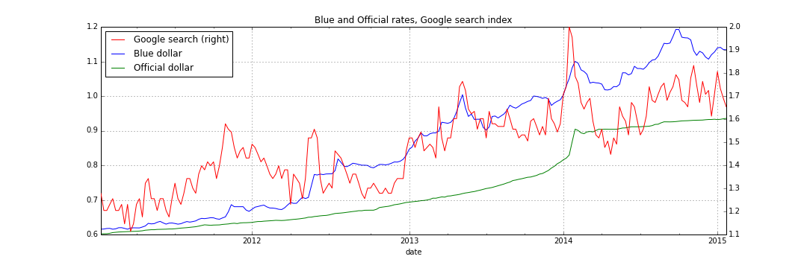
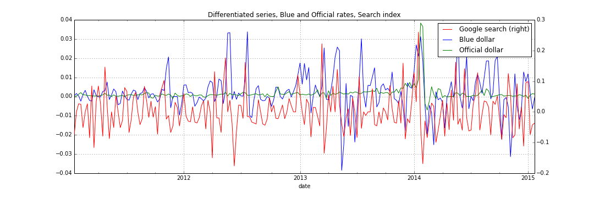
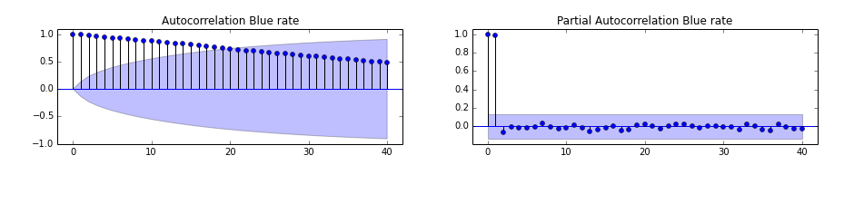
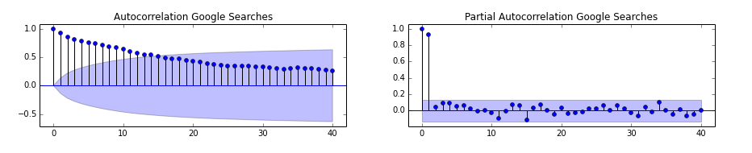
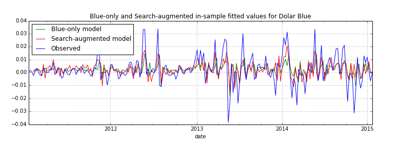

# Dollar Blues: Predicting the Black Market Exchange Rate in Argentina through Google Search Behavior

*Feb 2015 - This was my submission to the Data Incubator Program*

## 1. Motivation 

In recent years, a deteriorating political and economic situation and increasing capital flight has led the Argentinean government to impose capital controls, making the exchange of pesos into dollars illegal. Nevertheless, a vibrant black market has sprung, what locals call the “el dolar blue”. And while the capital controls have served to slow the capital flight, it has not been effective in preventing it.

With inflation over 40% a year, Argentineans are desperate to convert their pesos into dollars before they lose their value.  Demand for dollars is so high that black-market exchange rate has at times exceeded the government’s official rate by as much as 70%.  Dwindling Central-Bank Reserves mean that the authorities are losing the ability to maintain the current exchange rate. In fact, in January 2014, the government was forced to depreciate the currency in excess of 15% in one day, a precipitous drop.   

The fact that it is illegal to exchange pesos into dollars means that it is difficult to obtain a good measure of the parallel exchange rate. My hypothesis is that Google searches for the word “dolar” (dollar in Spanish), restricted to searches in Argentina, can serve as a proxy measure for current dollar demand in Argentina, since people seeking to exchange their currency will be seeking information online. 

I also propose to investigate whether Google searches can serve as warning indicator of future dollar demand. This could potentially be the case if Google searches are a reflection of investor’s expectations of future devaluation. 	

Understanding the black market exchange rates is important because a widening gap between the black market and official exchange rate suggests a higher probability of further currency devaluation. 

## 2. Data

The Argentinean newspaper, La Nación, releases daily rates of the “blue” and official dollar, which we will use a ground truth data in order to validate our estimates. 

A weekly index of Google searches for the world “dolar” (dollar in Spanish) restricted to Argentina is available from Google Trends. The Google search index does not represent absolute search volume but reflects how many searches have been done for a particular term, relative to the total number of searches done on Google over time. In this sense, it can be interpreted as a measure of “salience” of the currency issue. 

## 3. Preliminary Analysis 

Because the daily exchange rate data and weekly search index have different frequencies, the exchange rate data was resampled by taking the weekly mean. Both series were log transformed in order to make the data more normal and decrease the influence of outliers. 

Plotting the blue and official rates, along with the Google search index for the word “dolar” suggests that the Google searches tracks the evolution of the blue rate quite closely.  As a naïve correlation measure, I estimated the Pearson correlation coefficient of 0.85 between the search index and the blue exchange rate, and 0.79 between the search index and the official rate. 

However, the correlation coefficients are probably overestimated since all three series exhibit the same clear upwards trend. We can differentiate each series, that is, for each observation, take the difference between that observation and the previous one, in this way effectively getting rid of the trend.

Our new correlation coefficients calculated on the differentiated data show that the search index and the Blue exchange rate have a correlation index of 0.17, while the correlation coefficient estimated between search and the official exchange is not statistically significantly different from zero. 

To assess whether Google searches have any explanatory power, I compare the forecasting accuracy of two alternative models: the first one uses pasts values of the Blue rate itself to predict future values of the Blue rate. The second model augments the first one by adding past values of the search index as well. 

Two measures of forecasting accuracy were used, the Root Mean Squared Error (RMSE) of in-sample predictions – where the model is trained on all observations and we calculate the RMSE of the difference between observed and fitted values – as well as the RMSE of multiple out-sample 1-step ahead predictions, were the model trained on 100 past observations predicts 1-step ahead. 

To find the best fit of an autoregressive integrated moving average (ARIMA) time-series model to past values of a time series, I used the Box-Jenkins methodology (Box & Jenkins, 1970). By plotting the Autocorrelation (ACF) and Partial Autocorrelation functions (PACF) for the Blue rate and the search index, one can make a choice of whether to model each series with autoregressive components, moving average components, how many lags for each and whether differencing the series is necessary. 

The patterns of the ACF and the PACF for both the Blue rate and the search index suggest that each model should have two autoregressive parameters. An additional statistical test, the Bayesian information criterion (BIC), was also used to confirm the optimal lag of the autoregressive parameters. 

An additional requisite for ARIMA models is that the series be stationary – that is, have constant mean and variance over time. Our first graph showed that neither the Blue rate nor the search index was stationary, so each series was differentiated once, and while the result was still not perfectly stationary, it was deemed to be good enough for the purposes of this proof of concept exercise. 

To model the effect of both lagged values of the Blue rate and search index on the Blue rate, we used a Vector Auto-Regressive model (VAR). In the case of the VAR, the Bayesian information criterion (BIC), suggested an optimal lag of 3 autoregressive parameters. We experimented with 2 and 3 lagged values and our results were robust to alternative specifications. 

The search-augmented model had an in-sample RMSE 8% smaller than the Blue-only model. The search-augmented model had a RMSE 5% smaller for the out-sample 1- step ahead predictions. These are modest gains in performance, but ones that suggests that search behavior adds explanatory power. 

Additional evidence that Google search data can be useful in predicting the Black market exchange rate is the fact that a Granger test, a statistical test used to determined whether one time series is useful in forecasting another, shows, through a series of t-tests and F-tests on lagged values of search-behavior, that search data does in fact provide statistically significant information about future values of the Blue rate.

## 4. Conclusion

This note aims to be a proof-of-concept that google search behavior can be used to track and predict black market exchange rates in Argentina. 

While the models used here are very simple, I argue that they can serve as a sufficient benchmark to test whether Google search information provides any additional explanatory power to our prediction of the Blue exchange rate. The performance gains in our search-augmented predictive models are modest, but an indication that further refinement of the models may be fruitful.

A major drawback of this study is that due to Google trends data limitations, we are working with weekly data. This potentially could be remedied by using higher frequency data, such as daily data from the social media platform Twitter as a proxy for dollar demand in Argentina. 

We are also most likely not capturing the entirety of currency-related search behavior since we are only using information for one search term. There are many different searches such as “dolar blue” and “blue cotazion hoy” that if used together, may increase the predictive power of our model. 
